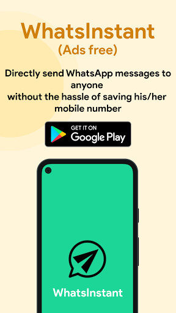
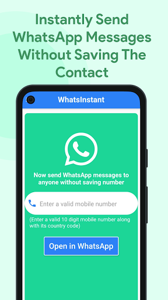
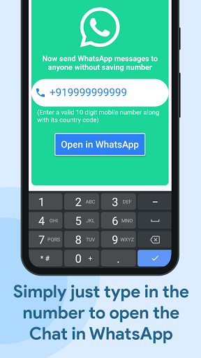

<p align="center">
  
</p>


# WhatsInstant: A Whatsapp Utility Flutter App

Introducing WhatsInstant - the ultimate solution for hassle-free WhatsApp chatting!

Tired of saving phone numbers just to chat with someone on WhatsApp or WhatsApp Business? With WhatsInstant, you can now open a chat with anyone without the need to save their number on your phone. Say goodbye to cluttered contact lists and hello to seamless conversations!

🌟 Instant Chat: Open chats with friends, family, or business contacts effortlessly. Simply enter the desired number, click "Open Chat," and start messaging right away. No more tedious saving of contacts required!

📲 Chat with Yourself: Want to jot down important notes or send reminders to yourself on WhatsApp? WhatsInstant allows you to open a chat with yourself, bypassing the limitations imposed by WhatsApp. Stay organized and in control, all in one place.

✨ User-Friendly Interface: We believe simplicity is key. WhatsInstant offers an intuitive interface with just a single textbox and an easy-to-spot "Open Chat" button. No complicated menus or confusing features to distract you from what matters most: seamless communication.

💯 Privacy at its Core: Rest assured, WhatsInstant prioritizes your privacy. We do not store any personal information or chat data. Your conversations remain between you and your contacts, just as they should be.

⚡ Lightning-Fast Performance: With WhatsInstant, speed is of the essence. Experience swift and efficient chat openings, ensuring that you never miss out on important conversations or updates.

🌐 Universal Compatibility: Whether you're using WhatsApp or WhatsApp Business, WhatsInstant seamlessly integrates with both versions. It's designed to enhance your chatting experience across the board.

Upgrade your WhatsApp communication to a whole new level with WhatsInstant. Embrace the simplicity, flexibility, and convenience of opening chats without saving numbers. Download now and revolutionize the way you connect on WhatsApp!

Note: WhatsInstant is a third-party app and is not affiliated with WhatsApp Inc.


## Screenshots

<table>
  <tr>
    <td></td>
    <td></td>
    <td></td>
    <td></td>
  </tr>
</table>


## Tech Stack

**Frontend:** Flutter


## Run Locally
Make sure, flutter is installed in your machine. If not, then follow this: [INSTALLATION GUIDE](https://docs.flutter.dev/get-started/install). After that, follow the below steps:

Clone the project

```bash
  git clone https://github.com/vibhudawar/WhatsInstant.git .
```

Install dependencies

```bash
  flutter pub get
```
Then run the project from through **RUN WITHOUT DEBUGGING**, in your emulator


## Google Playstore Link
[LINK](https://play.google.com/store/apps/details?id=com.phoenix.whats_instant)
## License

[MIT](https://choosealicense.com/licenses/mit/)

